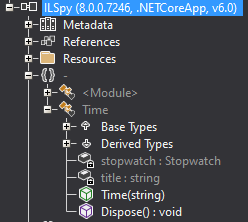

# BatchExport Plugin for ILSpy

## Purpose
Short story. I'm maintaining a mod for a game and have to check the same functions for any changes, again and again, after every game update. This always costs time and as a lazy technician you always want to improve repetitive tasks. So I wrote this plugin and decided to make it public, maybe there is someone out there who is in need of this, too. (I used it a few times and already saved ~30 minutes of my time)

## Installation
Tested with `v8.0.0`  

Download the latest binaries from [GitHub releases](../../releases).  
Copy the `BatchExport.Plugin.dll` to your ILSpy root folder. ILSpy will automatically load it when starting the application.  

## Usage
You will find a `Batch Export` entry inside the `File` menu and a symbol at the toolbar ( two disks icon instead of one disk for normal saving).  
A new window with a textbox will appear. You have to enter all the functions you want to export, one function per line. Seperate each node with a pipe (`|`). All inputs with less than one seperator will be ignored. Currently there is no upper limit for the seperators since the plugin searches recursevily but I think there will be a technicial limitation at some point.

## Example
Lets take a look at the `ILSpy.dll` loaded into ILSpy.  
  

In our example we want to export the `Time(string)` and `Dispose()` functions, so our possible input could be the following:
> ILSpy|-|Time|Time(string)  
> ILSpy|-|Time|Dispose()

The name of the very last function (that one you want to export) does not have to match exactly. In the above example the full name of the `Dispose()` function is `Dispose() : void`. You see that the full name of the functions contains the string I have given in the input, that's enough to match. Just make sure your input is unique and does not match with other functions in the same node.  
You can choose to export every function as a single file, or all as one file, via checkbox. If you choose the export it as single files, a save dialog will be shown for every function.

## Known Bugs
* once the process is started it can not be cancelled (even by closing the plugin window), this is because I'm an amateur and was not able to figure out how to properly implement threading/backgroundworker/whatever

## Disclaimer
When judging my code please keep in mind that I'm a noob and this was the first time I touched C#. My approach is definitely not the best but it works and fit my needs.

## Thanks
Thanks to all ILSpy developers and the ILSpy community for making such a nice tool!